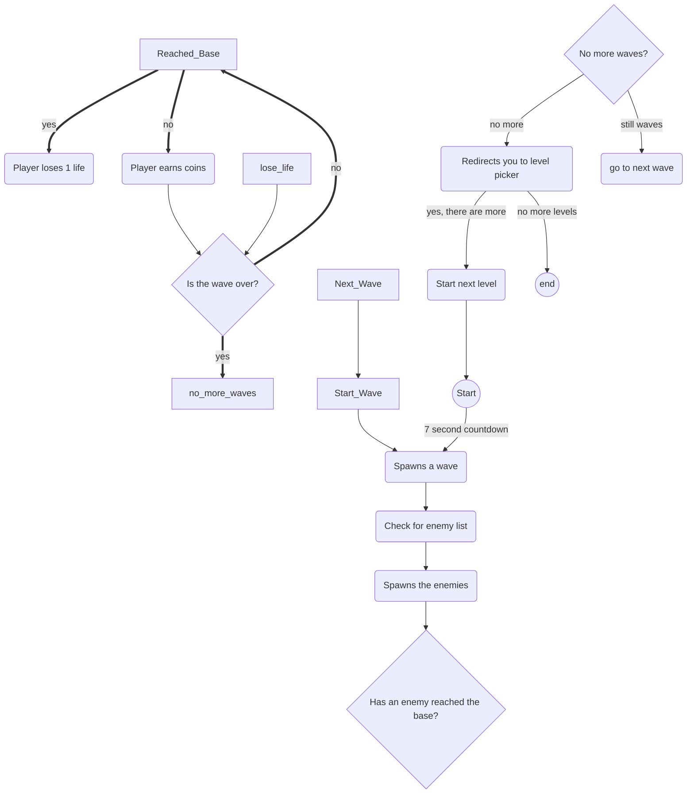

# Tower_Defense

## Flowchart voor Enemy AI script

```mermaid
flowchart TD

start((Start)) -->|7 second countdown| Wave_Spawner(Spawns a wave)
Wave_Spawner --> check(Check for enemy list)
check --> Enemy_Spawner(Spawns the enemies)
Enemy_Spawner --> Base_Check{Has an enemy reached the base?}
Reached_Base ==>|yes| Health_down(Player loses 1 life)
Reached_Base ==>|no| Currency(Player earns coins)
lose_life --> Wave_Clear{Is the wave over?}
Currency --> Wave_Clear
Wave_Clear ==>|no| Reached_Base
Wave_Count{No more waves?} -->|no more| More_Levels(Redirects you to level picker)
Wave_Clear ==>|yes| no_more_waves
Wave_Count -->|still waves| next_wave(go to next wave)
Next_Wave --> Start_Wave
Start_Wave --> Wave_Spawner
More_Levels -->|yes, there are more| Next_Level(Start next level)
More_Levels -->|no more levels| end_d((end))
Next_Level --> start
```
